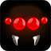

# Ringed
 

Ringed is a top-down shooter at an early stage of development. The character
is surrounded by bloodthirsty monster and must fight to survive.

The game is developed using the awesome open source [Godot engine](http://godotengine.org) by a team
of free/libre software aficionados called [KOBUGE-Games](http://www.kobuge.org).

## How to play

* Movement: WASD
* Sprint: Shift
* Dodge: Double press WASD
* Shoot: Left mouse button
* Switch weapon: Right mouse button

The default key bindings can be configured via the in-game menu.

## License

Ringed - 2D top-down shooter made with Godot Engine  
Copyright (C) 2015-2016  KOBUGE Games

This program is free software: you can redistribute it and/or modify
it under the terms of the GNU General Public License as published by
the Free Software Foundation, either version 3 of the License, or
(at your option) any later version.

This program is distributed in the hope that it will be useful,
but WITHOUT ANY WARRANTY; without even the implied warranty of
MERCHANTABILITY or FITNESS FOR A PARTICULAR PURPOSE.  See the
GNU General Public License for more details.

You should have received a copy of the GNU General Public License
along with this program.  If not, see <http://www.gnu.org/licenses/>.

